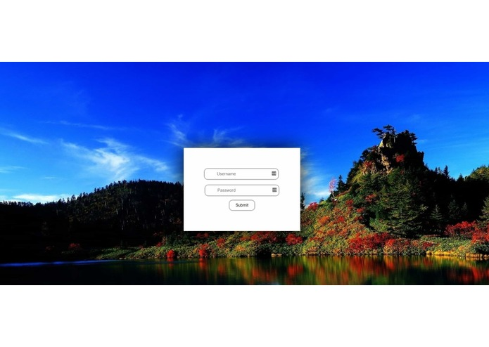

# SumNotes

# The Problem

Students have to take notes but also pay attention and learn material at the same time during lectures.

# Our solution

We created a web application which can be used to record a lecture, translate it to text and then summarize the information into notes for the student to review.

# How we built it

HTML & CSS front end using a Python backend with Flask to link the two. We used the webkit speech recognition API for speech to text and the SUMY API for the text to summary conversion. We also implemented a user login system which uses a Cockroach database.

# Challenges we ran into

Speech recognition is not an accurate technology and it takes time to process.

# Accomplishments we’re proud of

Learning Cockroach and implementing a user login system.

# Lessons we learned

One of the concepts we learned was implementing an SQL database because we did not have prior experience with this.

# What’s next for SumNotes

The next steps for SumNotes is to improve our speech recognition, implementing machine learning on datasets and exporting the notes into a formatted powerpoint for study notes.

# Built with:

HTML & CSS, JavaScript, JQuery, Python, Flask, webkit speech recognition API, SUMY API, Cockroach Database

Check out a demo!

